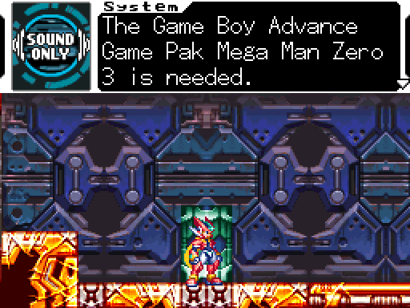

Mega Man ZX Slot-2 Patch
========================

Download
--------
Looking for the download link? Go here:
https://github.com/Prof9/MMZX-Slot2-Patch/releases

Introduction
------------
Mega Man ZX had a bonus feature where if you had Mega Man Zero 3 or Zero 4
inserted into Slot-2 of your Nintendo DS, you could fight four extra bosses from
that game. ZX actually loads all of the sprite and object data for these bosses
from the GBA Game Pak, and converts it to the newer format on-the-fly.

This was presumably done because the Japanese ROM for Mega Man ZX, due to having
full voiceovers, is very close to being 64 MiB. Adding in the Zero boss data
would have pushed it over the limit, meaning they would have had to produce the
game on more expensive 128 MiB Game Cards; so instead, the data is loaded from
the GBA Game Pak instead.

Unfortunately, this also makes it impossible to fight the bosses on a Nintendo
DSi, even when using cheats to get into the Zero boss rooms, because the sprite
data for those bosses just isn't on the DS Game Card. That's where this patch
comes in: it makes it so that the Zero boss data is now loaded from the Mega Man
ZX ROM itself, eliminating the need for a GBA cartridge to be inserted. A nice
side effect is that you can now also enter both the Zero 3 and Zero 4 boss rooms
without needing to restart the game.

Patches
-------
This archive contains three patches, one for each version of the game. The
patches are in .BPS format, so use a tool like Floating IPS to apply them to
your Mega Man ZX ROM.

You can download Floating IPS here: https://www.romhacking.net/utilities/1040/

 -  **mmzx-us.bps** - Use this patch for the North American version of the game.
 -  **mmzx-eu.bps** - Use this patch for the European version of the game.
 -  **rmzx-jp.bps** - Use this patch for the Japanese version of the game.

Note that the patch must be applied to a CLEAN ROM; you will not be able to
apply this patch to a ROM that has already had other modifications made to it,
such as an undub patch. If you want to apply this patch to an already
pre-patched ROM, see below for instructions on how to build the patch.

Building
--------
Source code for this patch is available in the included **src.zip** archive, or
online at: https://github.com/Prof9/MMZX-Slot2-Patch

In order to build this patch yourself, you can use the following instructions:

 1. Download **ARMIPS**, **BLZ** (from CUE's Nintendo DS/GBA Compressors) and
    **ndstool** (from devkitPro) and place these in the **tools** folder. See
    the **tools_go_here.txt** file for more details.
 2. Open **make.bat** and change the **_ROM_IN** variable near the top to point
    to your input ROM.
 3. Run **make.bat**. The output ROM will be produced in the **out** folder.

Credits
-------
The true heroes here are Inti Creates, putting so much love into this game
that they somehow managed to add 8 more bosses despite the cartridge already
being full. Go buy some of their newer games to support them.

You can @ me here, unless you don't think Mega Man ZX is the greatest Mega Man
game ever made, in that case don't @ me.

 *  **Twitter:** [Prof9](https://twitter.com/Prof9)
 *  **E-mail:** prof9@outlook.com
